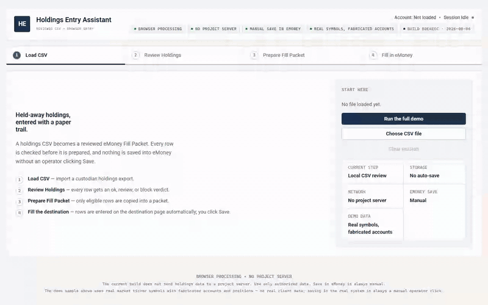
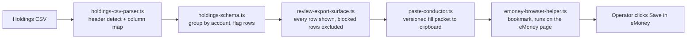

# Holdings Entry Assistant

[](https://cmathew654-dot.github.io/emoney-holdings-entry-assistant/)
[](https://www.typescriptlang.org/)
[](LICENSE)



I built this browser-local assistant to reduce a 1–2 hour holdings-entry task to 3–5 minutes. It flags ambiguous rows before preparing eligible entries for eMoney, where the user reviews each entry and clicks Save.

[Try the synthetic demo](https://cmathew654-dot.github.io/emoney-holdings-entry-assistant/) or [read how the project started](docs/how-it-started.md).

The [reconstructed intake interview](https://cmathew654-dot.github.io/emoney-holdings-entry-assistant/how-it-started/) shows the original requirements.

## What it does

1. Detects the holdings header and maps common CSV column names.
2. Groups positions by account and flags cash, duplicates, unusual pricing, and unmapped account types.
3. Shows every row before entry and excludes blocked rows by default.
4. Prepares ticker, units, and cost basis in a versioned fill packet.
5. Runs only when the operator clicks a bookmark on an eMoney Holdings page. Save remains manual.

I designed the tool to stop on ambiguous matches instead of guessing. I exclude market value from the fill packet so the operator can compare it on screen.

## How it fits together



## Data boundary

The current browser build does not send holdings data to a project server. When the operator asks for a prepared packet, the browser copies it to the system clipboard. The bookmark reads the packet on the visible eMoney page.

“Clear session” removes loaded data from the page. It clears the clipboard only if the clipboard still contains this session's last payload. If the operator copied something else afterward, the command leaves it alone. Use only synthetic or otherwise authorized data.

See [DISCLAIMER.md](DISCLAIMER.md) for the project boundary and [SECURITY.md](SECURITY.md) for private vulnerability reporting.

## Run it

```bash
npm ci
npm test
npm run typecheck
npm run build:demo
npm run build:portable
npm run test:portable
```

`npm run start:demo` serves the browser build locally. The portable build produces one self-contained HTML file with a restrictive content security policy.

The implementation is TypeScript and plain DOM code, with Node’s built-in test runner, esbuild for the portable artifact, and an optional Tauri shell.

## License

MIT. See [LICENSE](LICENSE).
