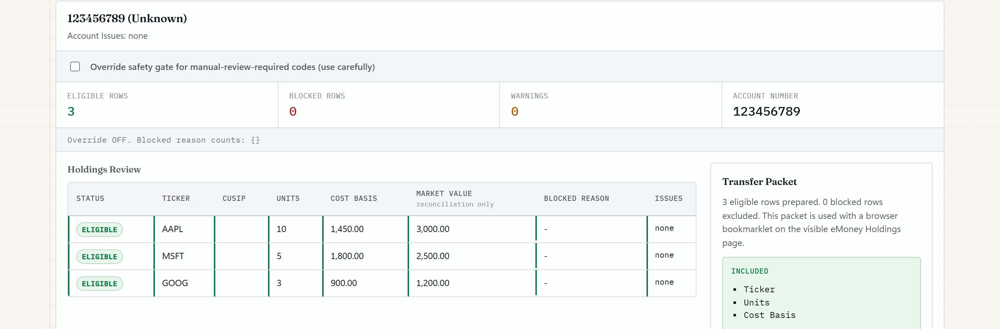

# eMoney Holdings Injector

A local-only tool that turns a custodial holdings export (CSV) into a reviewed, human-confirmed data entry pass into [eMoney Advisor](https://emaplan.com) (Fidelity's financial planning platform for advisors). It parses the file, gates which rows are safe to enter, and then uses a browser bookmarklet to fill three fields per holding on eMoney's own Holdings page. The advisor reviews and saves manually every time.

Built by a practicing financial advisor (Series 7/63/65) to remove a repetitive, error-prone part of client onboarding and account maintenance.

**[▶ Try the live demo](https://cmathew654-dot.github.io/emoney-holdings-injector/)** — loads a synthetic sample and walks the full review → packet → simulated-fill flow in your browser. Nothing is uploaded anywhere.

   

**The Regulated Ledger** — every parsed row gets an eligible/review/block verdict with the reason on the row, and the Transfer Packet carries exactly three fields.



## The problem

Advisory firms plan against eMoney, but held-away or newly transferred accounts often arrive as a custodial CSV, not a clean eMoney import. The common workaround is manually re-keying ticker, share count, and cost basis for every position, one field at a time, while cross-checking a spreadsheet. It is slow and it is exactly the kind of repetitive manual entry where transposition errors happen.

This tool does not automate away the advisor's judgment. It automates the typing, after the advisor has reviewed what will be typed.

## How it works

1. **Parse** — `holdings-csv-parser.ts` reads a custodial CSV, detects the header row (handles preamble/report lines above it), maps common column aliases (`Symbol`/`Ticker`, `Quantity`/`Shares`/`Units`, etc.), and groups rows into accounts.
2. **Gate** — Every row is checked against a conservative eligibility policy before it's exportable: cash rows, zero-price/nonzero-value rows, duplicates, and unmapped account types are flagged and excluded by default. Nothing is silently dropped; everything shows up as a visible issue.
3. **Review** — `review-export-surface.ts` renders a "Regulated Ledger" view (`ledger-styles.ts`) where the advisor sees every row's eligible/blocked status and why, before anything is prepared for entry.
4. **Fill Packet** — Reviewed, eligible rows are packaged into a versioned "eMoney Fill Packet" (`paste-conductor.ts`) containing only ticker, units, and cost basis per holding.
5. **Bookmarklet entry** — The advisor drags a "Fill eMoney Holdings" bookmarklet to their browser bar once. On the live eMoney Holdings page, clicking it shows a confirmation overlay with the account and row count. After confirming, `emoney-browser-helper.ts` matches each holding to an existing row (by CUSIP, then ticker, then description) or adds a new one, and fills only the approved fields. The advisor reviews the page and clicks Save in eMoney manually — the tool never does this for them.

## Safety guarantees

This is the part that matters most in a compliance-sensitive workflow, so it's enforced in code, not just policy:

- **Local-only.** No backend, no server, no external API calls for client data. Parsing and rendering happen entirely in the browser (or the optional local desktop shell).
- **Three fields, never more.** The bookmarklet writes exactly ticker, units, and cost basis. It does not write market value, asset class, sector, or description — eMoney derives market value from shares and pricing, so the tool treats it as reconciliation-only, not something to overwrite.
- **Never saves.** There is no code path that clicks Save. Every entry ends with the advisor reviewing the page and saving manually.
- **Ambiguous matches hard-stop.** If a holding matches more than one row on the page by CUSIP, ticker, or description, the helper refuses to guess (`AMBIGUOUS_MATCH`) and requires manual resolution instead of picking one.
- **Conservative-by-default gating.** Cash rows, zero-price/nonzero-value rows, unmapped account types, and duplicate holdings are excluded from the Fill Packet unless an operator explicitly reviews and overrides — override is off by default.
- **Versioned packet format.** The Fill Packet carries a schema version; a mismatched version is rejected rather than partially applied.
- **No hidden automation surface.** This is a bookmarklet the advisor clicks on the visible eMoney page, not a browser extension, background service, or API integration — nothing runs without a human clicking it, on the page they're currently looking at.

## Tech stack

- TypeScript, compiled with `tsc` and bundled for the browser demo with `esbuild` — no frontend framework.
- Plain DOM rendering (`review-export-surface.ts`, `ledger-styles.ts`) for the review UI.
- Node's built-in test runner (`node:test`) for parser, review-surface, packet, and browser-helper tests (the browser helper is tested against a lightweight fake-DOM harness, not full browser E2E).
- Optional [Tauri](https://tauri.app) shell (`src-tauri/`) for a Windows-first desktop build of the same local workflow — same code, no server, no API access added.

## Running it

```bash
npm install
npm test            # type-checks + runs the parser/review/packet/helper test suite
npm run typecheck    # no-emit TypeScript check across all modules
npm run build:demo   # builds the static browser demo into demo-dist/
npm run start:demo   # builds + serves the demo at http://localhost:8080/
```

To try the full flow without any real client data, use the sample file in [`sample-data/sample-holdings.csv`](sample-data/sample-holdings.csv) — fake account numbers, a fake household ("Sample Household"), and public tickers (VTI, AAPL, VXUS, BND), plus a cash row and a zero-price row so you can see the eligibility gate actually block and flag something. Load it from the demo UI's "Choose CSV File" control after running `npm run start:demo`.

There is no `desktop:dev`/`desktop:build` step required to evaluate this repo — those build the optional Tauri shell and require a Rust toolchain.

## Privacy & safety

- No real client data is included anywhere in this repository. `sample-data/sample-holdings.csv` uses fake account numbers and a fake household name.
- The tool never transmits holdings data off the local machine — there is no network call in the parsing, review, or fill path.
- eMoney is a product of Fidelity/eMoney Advisor. This project is an independent, unaffiliated helper that operates entirely through the standard browser page an advisor is already logged into; it is not an eMoney API integration and is not endorsed by eMoney.

## License

MIT — see [LICENSE](LICENSE).
