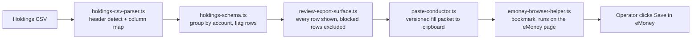

# Holdings Entry Assistant

[](https://cmathew654-dot.github.io/emoney-holdings-entry-assistant/)
[](https://www.typescriptlang.org/)
[](LICENSE)

<!-- walkthrough-gif -->

A browser-based helper for reviewing holdings CSVs and preparing repetitive holdings entry in eMoney. It came out of a simple question: where was planner time disappearing during plan setup, and which part of that work was mechanical enough to make easier?

The demo uses synthetic data. It parses a CSV, shows which rows need attention, and prepares eligible rows for browser entry. The operator reviews the destination page and clicks Save in eMoney manually.

[Try the synthetic demo](https://cmathew654-dot.github.io/emoney-holdings-entry-assistant/) · [See the reconstructed intake interview](https://cmathew654-dot.github.io/emoney-holdings-entry-assistant/how-it-started/) · [Read how it started](docs/how-it-started.md)

## What it does

1. Detects the holdings header and maps common CSV column names.
2. Groups positions by account and flags cash, duplicates, unusual pricing, and unmapped account types.
3. Shows every row before entry and excludes blocked rows by default.
4. Prepares ticker, units, and cost basis in a versioned fill packet.
5. Runs only when the operator clicks a bookmark on an eMoney Holdings page. Save remains manual.

Ambiguous matches stop instead of guessing. Market value stays visible for comparison but is not written by the fill packet.

## How it fits together



## Data boundary

The current browser build does not send holdings data to a project server. A prepared packet is copied to the system clipboard when the operator asks for it, then read by the bookmark on the visible eMoney page.

“Clear session” removes the loaded data from the page. It clears the clipboard only when the clipboard still contains the last payload written by this session; anything copied later is preserved. Use only synthetic or otherwise authorized data.

See [DISCLAIMER.md](DISCLAIMER.md) for the project boundary and [SECURITY.md](SECURITY.md) for private vulnerability reporting.

## Run it

```bash
npm ci
npm test
npm run typecheck
npm run build:demo
npm run build:portable
npm run test:portable
```

`npm run start:demo` serves the browser build locally. The portable build produces one self-contained HTML file with a restrictive content security policy.

The implementation is TypeScript and plain DOM code, with Node’s built-in test runner, esbuild for the portable artifact, and an optional Tauri shell.

## License

MIT. See [LICENSE](LICENSE).
